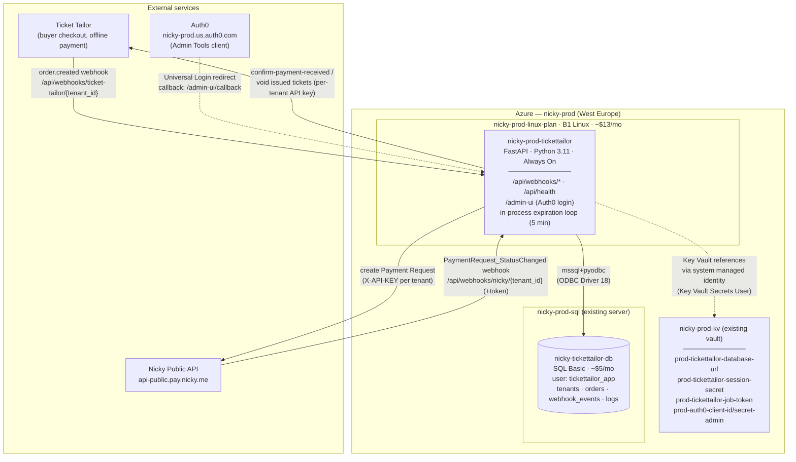
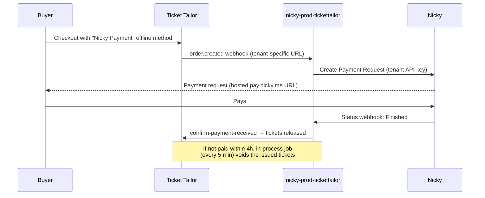

# Ticket Tailor Integration — Azure Production Architecture

Deployed 2026-07-08 into resource group `nicky-prod` (subscription `6c7f81bf-a5a0-4520-8c15-0bfd922ca50b`).
All resources tagged `tickettailor-related=true`.

## Payment lifecycle

## Pending wiring

- Auth0 callback `https://nicky-prod-tickettailor.azurewebsites.net/admin-ui/callback` not yet registered — admin login blocked until then.
- Custom `nicky.me` subdomain (Cloudflare CNAME + hostname binding + managed cert) not yet set up.
- Tenant data still on the old Vercel/MySQL deployment; Ticket Tailor webhooks per tenant still point at `*.vercel.app`.
